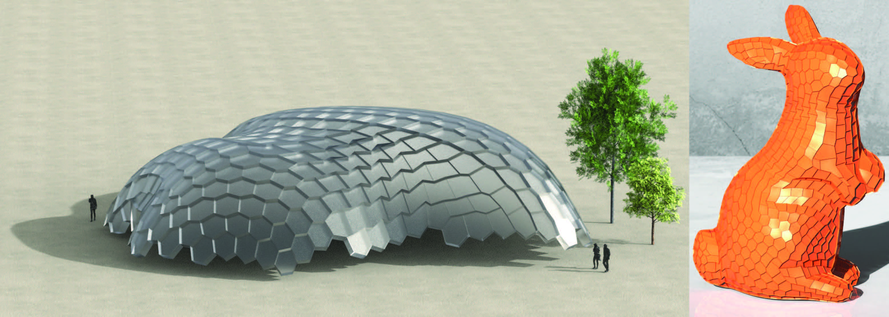

# Planar Hexagonal Meshing


MATLAB implementation of 
"PH-CPF: Planar Hexagonal Meshing using Coordinate Power Fields" by 
[Kacper Pluta](https://copyme.github.io/), 
Michal Edelstein, 
[Amir Vaxman](https://webspace.science.uu.nl/~vaxma001/) and 
[Mirela Ben-Chen](https://mirela.net.technion.ac.il/).

[Paper](https://www.cs.technion.ac.il/~mirela/publications/phcpf.pdf), 
[Supplemental](https://www.cs.technion.ac.il/~mirela/publications/phcpf-supp.pdf), 
[Video](https://www.youtube.com/playlist?list=PLIFSk5-vAIZ01pnibtAh5Vz87gNNqmbC_)





If you have any questions or issues running the code, please open an issue or contact smichale@cs.technion.ac.il


## Getting Started

- Clone this repository:
```bash
git clone https://github.com/michaled/PH-CPF.git
```

- Run the ```runme.m``` script in MATLAB


### Note
- This is a MATLAB implementation and requires MATLAB 2019a or newer

- This code includes Windows precompiled binaries. The source code and versions for MacOS and Linux are coming soon!
 

 
### Output files
 - meshname.out.off - the primal mesh
 - meshname.out_d.off - the dualized mesh (if requested)
 - meshname.out_d_p.off - the planarized mesh (or meshname.out_p.off without dualization)
 - meshname.out_d_p_tri.off - the triangulated planarized mesh (or meshname.out_p_tri.off without dualization)
 - meshname.obj - the cut mesh with texture coordinates

#### Triangulation
Most of the rendering software packages triangulate a polygonal input mesh to render it.
Therefore, if the triangulation fails, the mesh will not be displayed or it might show visual artifacts such as holes and inverted triangles.
Hence, we additionally provide as output a triangulated version for rendering purposes.
However, please note, that our triangulation algorithm is also not perfect, and thus may lead to self intersections (even in cases when the input polygonal faces were intersection-free).

## Dependencies
 
 Our project was built using the following open source projects:

[libigl](https://libigl.github.io/), 
[Directional](https://avaxman.github.io/Directional/), 
[libhedra](https://avaxman.github.io/libhedra/), 
[Ceres Solver](http://ceres-solver.org/), 
[CGAL](https://www.cgal.org/), 
[Eigen](http://eigen.tuxfamily.org/), 
[Boost](https://www.boost.org/), 
[SuiteSparse](https://people.engr.tamu.edu/davis/suitesparse.html), 
[GMP](https://gmplib.org/), [MPFR](https://www.mpfr.org/), 
[Cygwin](https://www.cygwin.com/), [gptoolbox](https://github.com/alecjacobson/gptoolbox/), 
[geom3d](https://www.mathworks.com/matlabcentral/fileexchange/24484-geom3d), 
[WOBJ_toolbox_Version2b](https://github.com/sauravag/FIRM-MATLAB/tree/master/ExternalToolboxes/WOBJ_toolbox_Version2b)

## Citation

If you find this code useful, please cite our paper:

```
@article{pluta2021ph,
  title={PH-CPF: planar hexagonal meshing using coordinate power fields},
  author={Pluta, Kacper and Edelstein, Michal and Vaxman, Amir and Ben-Chen, Mirela},
  journal={ACM Transactions on Graphics (TOG)},
  year={2021},
}
```
